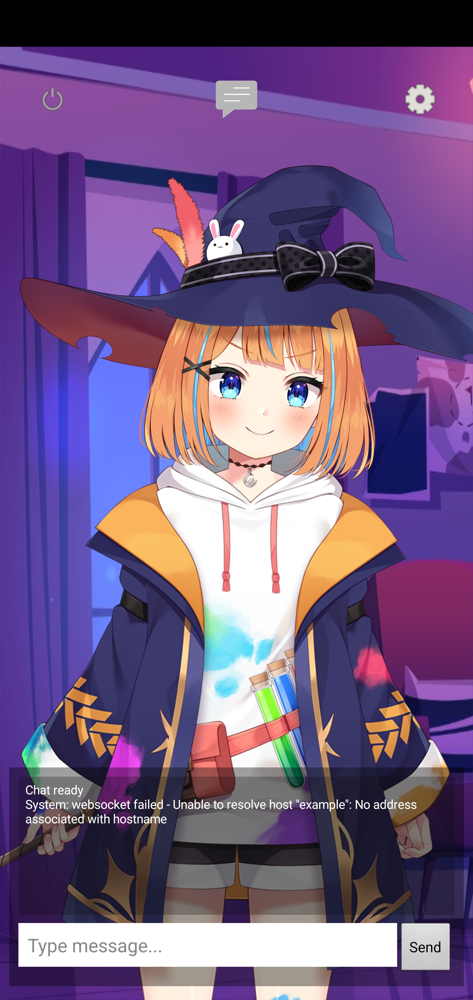
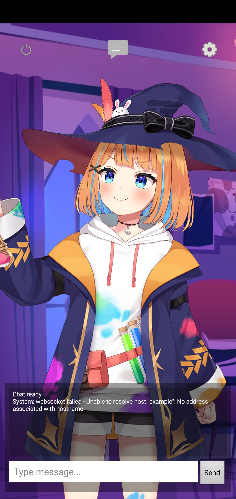

# Agent_mobile
An APK release of the front end application using Cubism SDK to control Live 2D model. Model can be connected to LLM based agent and controlled by parameters

# Previews

### Idle Avatar (Mao - model from Cubism SDK)

### Avatar react on touch

# Description
You can now see your text generated agent comes to live by connecting them to this application. Simply enter your agent's websocket and save.

# Attention:
Needs to provide websocket address to connect the app to your exposed websocket.
